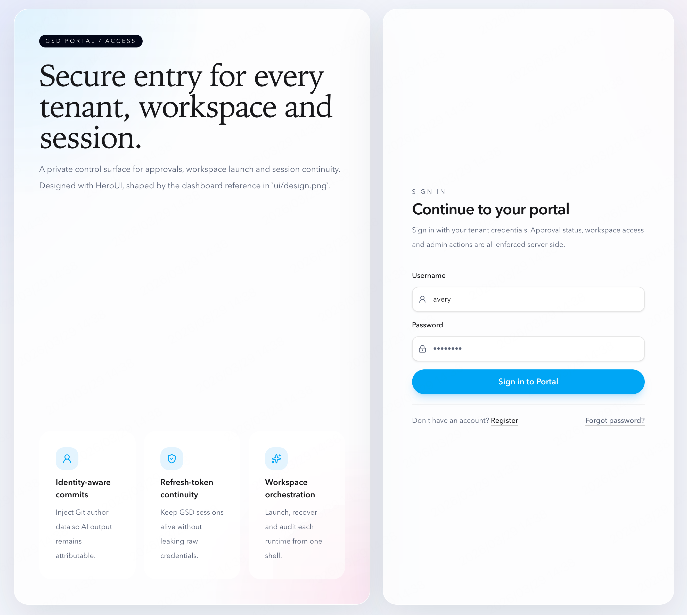
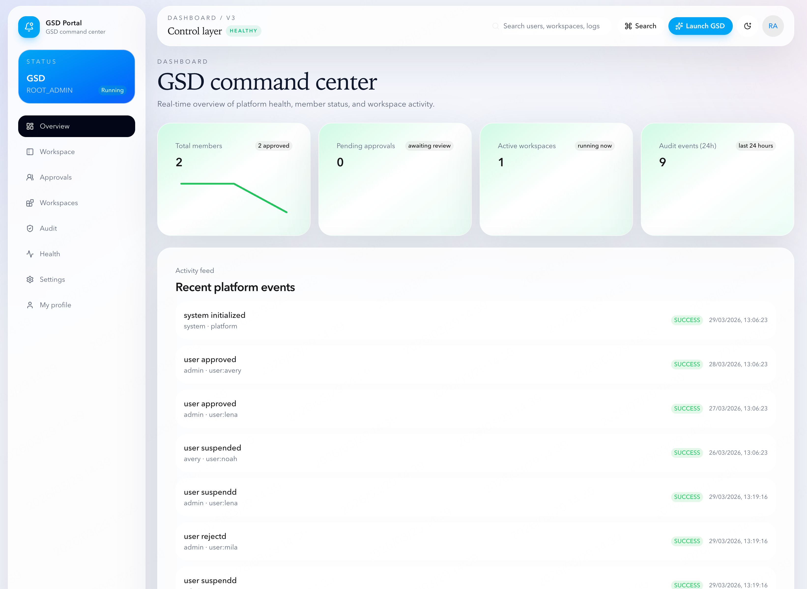
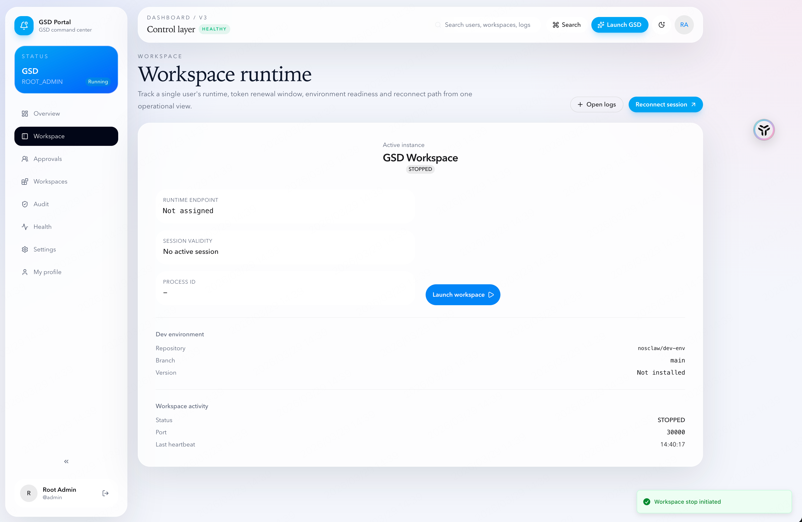
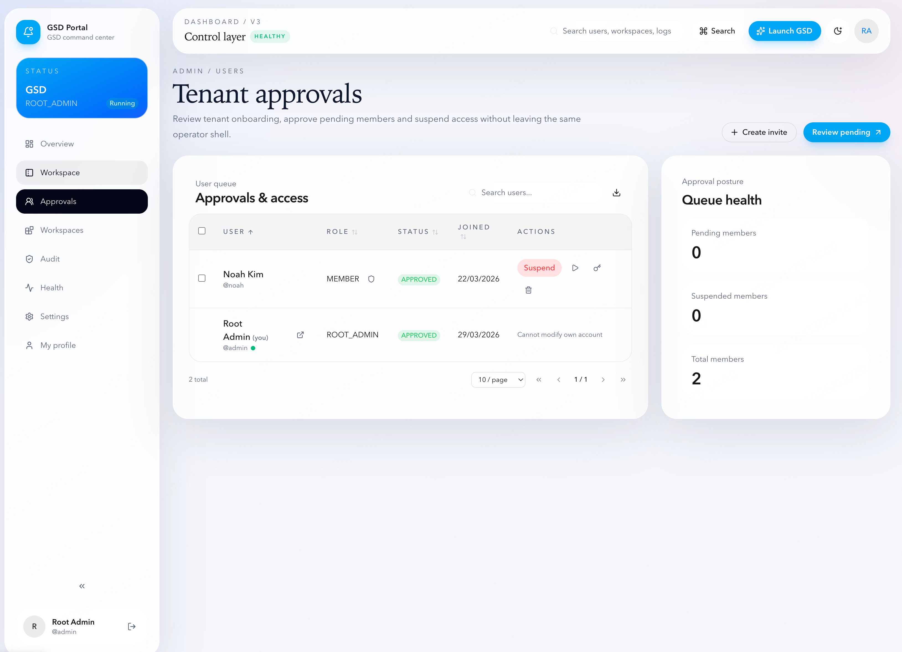
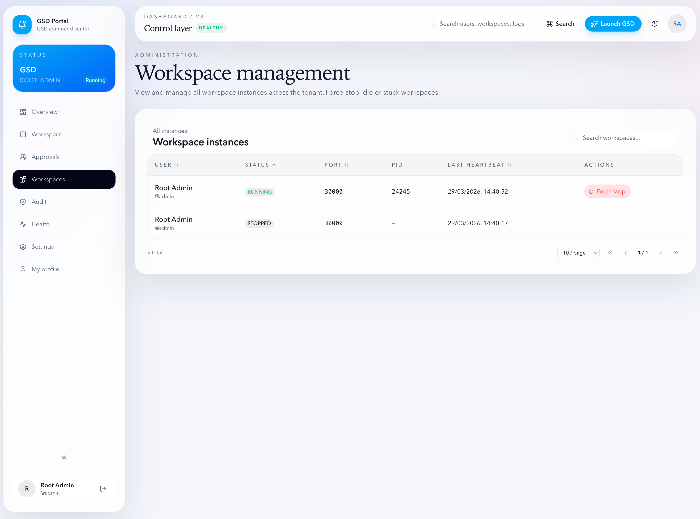

# GSD Portal

Multi-tenant workspace management platform for [GSD](https://github.com/nosclaw/gsd). Provides user authentication, workspace orchestration, dev environment initialization, and a unified domain-based access layer.

## Screenshots

| Login | Dashboard |
|:---:|:---:|
|  |  |

| Workspace Runtime | Tenant Approvals |
|:---:|:---:|
|  |  |

| Workspace Management |
|:---:|
|  |

## Architecture

```
Browser → Cloudflare Tunnel → Portal (:29000) → GSD Workspace (:30000+)
                                  ↓
                            ws-proxy (:29001) → token-based routing
```

- **Portal** — Next.js 16 + HeroUI, handles auth, user management, workspace lifecycle
- **ws-proxy** — Lightweight Node.js reverse proxy, routes to GSD instances by auth token
- **GSD Workspaces** — Per-user GSD web instances, isolated home directories at `/home/{username}`

## Quick Start

```bash
# 1. Clone and install
git clone https://github.com/nosclaw/gsd-portal.git
cd gsd-portal
bun install

# 2. Configure environment
cd docker
cp ../.env.example .env
# Edit .env — set AUTH_SECRET, APP_BASE_URL, WORKSPACE_DOMAIN

# 3. Start
docker compose up --build -d

# 4. Open
open http://localhost:29000
```

## Environment Variables

| Variable | Description | Default |
|---|---|---|
| `AUTH_SECRET` | Session encryption key (required) | — |
| `APP_BASE_URL` | Portal URL | `http://localhost:29000` |
| `WORKSPACE_DOMAIN` | GSD workspace domain | — |
| `WORKSPACE_ROOT_DIR` | User home directories | `/home` |
| `DEV_ENV_DIR` | Shared dev-env repo path | `/opt/dev-env` |
| `IDLE_RECLAIM_MINUTES` | Auto-stop idle workspaces after | `60` |

## Seed Accounts

First boot auto-creates these accounts:

| Username | Password | Role | Status |
|---|---|---|---|
| `admin` | `admin123` | ROOT_ADMIN | APPROVED |
| `avery` | `member123` | TENANT_ADMIN | APPROVED |
| `lena` | `member123` | MEMBER | APPROVED |
| `mila` | `member123` | MEMBER | PENDING |
| `noah` | `member123` | MEMBER | SUSPENDED |

Login with `admin` / `admin123`, then approve other users from the Approvals page.

## Features

### User Management
- Registration with admin approval flow
- Role hierarchy: ROOT_ADMIN > TENANT_ADMIN > MEMBER
- Promote/demote users, suspend, delete (with workspace cleanup)
- Confirm modal with typed username for destructive actions

### Workspace Orchestration
- One-click launch/stop/restart per user
- Admin can start/stop any user's workspace
- Auto-relaunch on browser refresh (GSD daemon mode)
- Port range configurable via admin settings (default 30000–39999)
- Workspace directory jailbreak protection

### Dev Environment
- Shared `nosclaw/dev-env` repo: first user clones, others pull
- `setup.sh` runs per-user with isolated HOME
- Background initialization — doesn't block workspace launch
- Version tracking and one-click update from UI

### GSD Integration
- Auto-skip onboarding with shared API key config
- Config priority: User's own > Admin shared > System default
- Default model and thinking level configurable in admin settings
- `.gitconfig` auto-generated per user (Git identity + GitHub PAT)
- `GSD_WEB_DAEMON_MODE` prevents shutdown on browser disconnect
- `SHELL=/bin/bash` for terminal compatibility

### Domain & Access
- Single workspace domain with token-based user routing
- ws-proxy handles old→new token translation on workspace restart
- Cloudflare Tunnel compatible (two hostnames, one port)
- Path-based fallback: `localhost:29000/w/{username}/`

### Security
- Encrypted token storage (AES-256-GCM)
- Session-time user status re-validation (suspended users auto-logout)
- Suspend action stops workspace + revokes session
- Bootstrap endpoint locked after first ROOT_ADMIN creation

## Docker Build

4-stage optimized Dockerfile:

```
Stage 1 (deps)         — bun install (cached unless package.json changes)
Stage 2 (builder)      — next build (~40s, parallel with Stage 3)
Stage 3 (runtime-base) — apt-get + GSD CLI (cached, parallel with Stage 2)
Stage 4 (runner)       — COPY only (seconds)
```

```bash
# Rebuild after code changes (cached layers, ~45s)
docker compose up --build -d

# Full rebuild (no cache, ~2min)
docker compose build --no-cache
```

## Project Structure

```
app/
  (portal)/           — Portal pages (dashboard, workspace, admin, settings)
  api/                — API routes (auth, workspaces, admin, user settings)
  auth/               — Login & registration pages
  w/[...path]/        — Path-based workspace proxy (fallback)
components/
  admin/              — User table, workspace table, audit log
  workspace/          — Workspace overview
  shared/             — Confirm modal, status chip, page skeleton
  app-shell/          — Sidebar, topbar
lib/
  orchestrator.ts     — Workspace lifecycle (launch, stop, GSD spawn)
  session-broker.ts   — GSD token management
  dev-env.ts          — Dev environment clone/init/update
  crypto.ts           — AES-256-GCM encrypt/decrypt
  workspace-url.ts    — URL generation (domain or path-based)
  scheduler.ts        — Background heartbeat, idle reclaim, token refresh
  env.ts              — Environment config + workspace jailbreak protection
docker/
  compose.yml         — Docker Compose configuration
  ws-proxy.js         — Workspace reverse proxy
  scripts/            — GSD install script (auto-detect prebuild vs compile)
docs/
  system-design.md    — Architecture and module design
  PRD.md              — Product requirements
```

## Documentation

- [Product Requirements (PRD)](./docs/PRD.md)
- [System Design](./docs/system-design.md)
- [Deployment Design](./docs/deployment-design.md)
