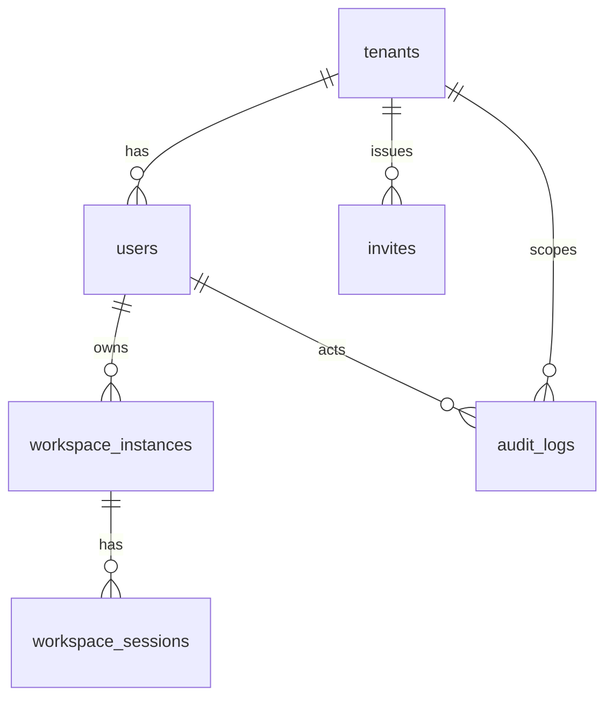

# GSD Portal Data Design

## 0. 文档信息
- 版本：v1.0
- 状态：Draft for Engineering Review
- 输入文档：[PRD](../PRD.md)、[系统设计](./system-design.md)

## 1. 设计原则
1. MVP 优先简单可落地，保持与单租户归属、单用户单工作空间的业务边界一致。
2. 所有状态流转必须可追踪，避免仅依靠内存状态。
3. GSD refresh token、敏感配置、密码哈希与审计日志要分开管理。
4. 业务表设计优先满足 SQLite + Drizzle ORM 的实现路径。

## 2. 实体关系总览


## 3. 枚举定义

### 3.1 `tenant_status`
- `ACTIVE`
- `SUSPENDED`
- `DELETED`

### 3.2 `platform_role`
- `ROOT_ADMIN`
- `USER`

### 3.3 `tenant_role`
- `NONE`
- `TENANT_ADMIN`
- `MEMBER`

### 3.4 `user_status`
- `INVITED`
- `PENDING`
- `APPROVED`
- `REJECTED`
- `SUSPENDED`

### 3.5 `workspace_state`
- `STOPPED`
- `STARTING`
- `RUNNING`
- `STOPPING`
- `ERROR`
- `EXPIRED`

### 3.6 `workspace_session_status`
- `ACTIVE`
- `REFRESHING`
- `FAILED`
- `REVOKED`
- `EXPIRED`

## 4. 表设计

### 4.1 `tenants`
| 字段 | 类型 | 约束 | 说明 |
| --- | --- | --- | --- |
| `id` | text | PK | 租户主键，推荐 `cuid2` |
| `slug` | text | UNIQUE NOT NULL | 租户短标识 |
| `name` | text | NOT NULL | 租户名称 |
| `status` | text | NOT NULL | `tenant_status` |
| `allow_self_signup` | integer | NOT NULL DEFAULT 0 | 是否允许开放注册 |
| `created_by_user_id` | text | NULL | 创建人，Root Admin |
| `created_at` | integer | NOT NULL | Unix timestamp |
| `updated_at` | integer | NOT NULL | Unix timestamp |

### 4.2 `users`
| 字段 | 类型 | 约束 | 说明 |
| --- | --- | --- | --- |
| `id` | text | PK | 用户主键 |
| `tenant_id` | text | NULL | Root Admin 可为空，普通用户必填 |
| `username` | text | UNIQUE NOT NULL | 登录名，全平台唯一 |
| `display_name` | text | NOT NULL | 显示名称 |
| `email` | text | NULL | 邮箱 |
| `password_hash` | text | NOT NULL | Argon2id 或同等级方案 |
| `platform_role` | text | NOT NULL DEFAULT 'USER' | `platform_role` |
| `tenant_role` | text | NOT NULL DEFAULT 'MEMBER' | `tenant_role` |
| `status` | text | NOT NULL | `user_status` |
| `rejected_reason` | text | NULL | 拒绝原因 |
| `approved_by_user_id` | text | NULL | 审批人 |
| `approved_at` | integer | NULL | 审批时间 |
| `suspended_at` | integer | NULL | 停用时间 |
| `last_login_at` | integer | NULL | 最后登录时间 |
| `created_at` | integer | NOT NULL | 创建时间 |
| `updated_at` | integer | NOT NULL | 更新时间 |

说明：
1. MVP 不引入 `tenant_memberships` 表，使用 `users.tenant_id` 保持实现简单。
2. 若后续进入 V2 再支持多租户归属，可把 `tenant_role` 下沉到关联表。

### 4.3 `invites`
| 字段 | 类型 | 约束 | 说明 |
| --- | --- | --- | --- |
| `id` | text | PK | 邀请记录主键 |
| `tenant_id` | text | NOT NULL | 所属租户 |
| `email` | text | NULL | 邀请邮箱 |
| `username_hint` | text | NULL | 预期用户名 |
| `token_hash` | text | NOT NULL | 邀请 token 哈希值 |
| `role_to_assign` | text | NOT NULL DEFAULT 'MEMBER' | 邀请后角色 |
| `status` | text | NOT NULL | `PENDING` / `ACCEPTED` / `REVOKED` / `EXPIRED` |
| `expires_at` | integer | NOT NULL | 过期时间 |
| `created_by_user_id` | text | NOT NULL | 创建人 |
| `created_at` | integer | NOT NULL | 创建时间 |

### 4.4 `workspace_instances`
| 字段 | 类型 | 约束 | 说明 |
| --- | --- | --- | --- |
| `id` | text | PK | 工作空间实例主键 |
| `tenant_id` | text | NOT NULL | 所属租户 |
| `user_id` | text | NOT NULL | 所属用户 |
| `state` | text | NOT NULL | `workspace_state` |
| `root_path` | text | NOT NULL | 工作空间目录 |
| `gsd_port` | integer | NULL | 当前 GSD 端口，运行时唯一 |
| `runtime_pid` | integer | NULL | GSD 进程 pid |
| `last_heartbeat_at` | integer | NULL | 最近心跳 |
| `idle_expires_at` | integer | NULL | 空闲回收时间 |
| `started_at` | integer | NULL | 启动时间 |
| `stopped_at` | integer | NULL | 停止时间 |
| `last_error_code` | text | NULL | 最近错误码 |
| `last_error_message` | text | NULL | 最近错误摘要 |
| `created_at` | integer | NOT NULL | 创建时间 |
| `updated_at` | integer | NOT NULL | 更新时间 |

约束：
1. 需要唯一索引保证一个用户只有一个活动工作空间。
2. `gsd_port` 在 `RUNNING` / `STARTING` 状态下必须唯一。
3. `root_path` 必须唯一。

### 4.5 `workspace_sessions`
| 字段 | 类型 | 约束 | 说明 |
| --- | --- | --- | --- |
| `id` | text | PK | 会话主键 |
| `workspace_instance_id` | text | NOT NULL | 所属工作空间 |
| `tenant_id` | text | NOT NULL | 所属租户 |
| `user_id` | text | NOT NULL | 所属用户 |
| `portal_session_id` | text | NULL | 关联 Portal Session |
| `status` | text | NOT NULL | `workspace_session_status` |
| `access_token_ciphertext` | text | NULL | access token 密文 |
| `refresh_token_ciphertext` | text | NULL | refresh token 密文 |
| `access_token_expires_at` | integer | NULL | access token 到期时间 |
| `refresh_token_expires_at` | integer | NULL | refresh token 到期时间 |
| `last_refreshed_at` | integer | NULL | 最近刷新时间 |
| `refresh_fail_count` | integer | NOT NULL DEFAULT 0 | 连续刷新失败次数 |
| `last_refresh_error_code` | text | NULL | 最近刷新错误码 |
| `created_at` | integer | NOT NULL | 创建时间 |
| `updated_at` | integer | NOT NULL | 更新时间 |

说明：
1. refresh token 必须只在服务端存储。
2. 建议使用应用层加密，例如 AES-GCM + `APP_DATA_ENCRYPTION_KEY`。
3. 每个运行中工作空间默认只保留一个 `ACTIVE` 会话。

### 4.6 `audit_logs`
| 字段 | 类型 | 约束 | 说明 |
| --- | --- | --- | --- |
| `id` | text | PK | 审计主键 |
| `tenant_id` | text | NULL | 平台级事件可为空 |
| `actor_user_id` | text | NULL | 执行人 |
| `actor_username` | text | NULL | 执行人快照 |
| `action` | text | NOT NULL | 如 `USER_APPROVED` |
| `resource_type` | text | NOT NULL | 如 `user`, `workspace`, `tenant` |
| `resource_id` | text | NULL | 资源主键 |
| `result` | text | NOT NULL | `SUCCESS` / `FAILURE` |
| `ip_address` | text | NULL | 请求 IP |
| `user_agent` | text | NULL | 请求 UA |
| `metadata_json` | text | NULL | 扩展字段 JSON |
| `created_at` | integer | NOT NULL | 事件时间 |

## 5. 关键索引与约束

### 5.1 必要索引
| 表 | 索引 | 用途 |
| --- | --- | --- |
| `tenants` | `slug` 唯一索引 | 快速按租户标识查询 |
| `users` | `username` 唯一索引 | 登录查找 |
| `users` | `(tenant_id, status)` | 管理后台筛选 |
| `workspace_instances` | `user_id` 唯一部分索引 | 保证单用户单活跃工作空间 |
| `workspace_instances` | `gsd_port` 唯一部分索引 | 避免端口冲突 |
| `workspace_sessions` | `(workspace_instance_id, status)` | 查询当前活动会话 |
| `audit_logs` | `(tenant_id, created_at desc)` | 管理后台查看日志 |
| `audit_logs` | `(actor_user_id, created_at desc)` | 追查个人行为 |

### 5.2 数据一致性规则
1. `users.status != APPROVED` 时，不允许创建 `ACTIVE` 的 `workspace_session`。
2. `workspace_instances.state != RUNNING` 时，不允许保留 `ACTIVE` 的 `workspace_session`。
3. 停用用户时，必须先把 `workspace_sessions` 改为 `REVOKED`，再停止工作空间。
4. 租户被停用时，租户下所有 `users` 和 `workspace_instances` 必须进入不可用状态。

## 6. 状态流转

### 6.1 用户状态流转
```text
INVITED -> PENDING -> APPROVED
PENDING -> REJECTED
APPROVED -> SUSPENDED
SUSPENDED -> APPROVED
```

### 6.2 工作空间状态流转
```text
STOPPED -> STARTING -> RUNNING
STARTING -> ERROR
RUNNING -> STOPPING -> STOPPED
RUNNING -> EXPIRED
ERROR -> STARTING
EXPIRED -> STARTING
```

### 6.3 会话状态流转
```text
ACTIVE -> REFRESHING -> ACTIVE
ACTIVE -> FAILED
ACTIVE -> REVOKED
ACTIVE -> EXPIRED
FAILED -> ACTIVE
```

## 7. 数据保留策略
1. `audit_logs` 默认保留 90 天。
2. `workspace_sessions` 保留最近 30 天历史，超过保留期的失效会话可归档或清理。
3. `workspace_instances` 作为历史资产保留，不建议物理删除。
4. `users` 和 `tenants` 默认只做软停用，不做硬删除。

## 8. 迁移建议
1. 第一批 migration 顺序建议为：`tenants -> users -> invites -> workspace_instances -> workspace_sessions -> audit_logs`。
2. SQLite 推荐启用 WAL 模式，提高并发读写稳定性。
3. `metadata_json` 先以 JSON 文本存储，避免在 MVP 过早拆太细。

## 9. 待确认事项
1. Root Admin 是否需要落在 `users` 表中且 `tenant_id = NULL`，还是单独存放于系统配置。
2. `workspace_instances` 是否需要单独的 `workspace_events` 表存放高频运行日志。
3. 如果 GSD refresh token 支持轮转，是否需要保留最近一次旧 token 的短暂回滚窗口。
