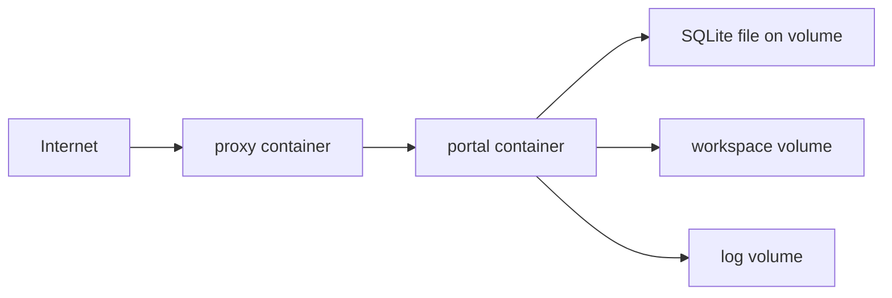

# GSD Portal Deployment Design

## 0. 文档信息
- 版本：v1.0
- 状态：Draft for Ops / Engineering Review
- 输入文档：[PRD](../PRD.md)、[系统设计](./system-design.md)

## 1. 目标
本设计用于定义 GSD Portal 的官方自托管部署方案，满足以下要求：
1. MVP 默认使用 Docker Compose 单机部署。
2. 支持 `local`、`staging`、`production` 多环境隔离。
3. 支持持久化、健康检查、升级、回滚和宿主机重启恢复。
4. 不把 Kubernetes 或 Helm 作为 MVP 前提。

## 2. 部署拓扑

### 2.1 MVP 单机拓扑


### 2.2 服务说明
| 服务 | 是否 MVP 必需 | 说明 |
| --- | --- | --- |
| `proxy` | 是 | 提供 HTTPS、反向代理、WebSocket 支持、统一入口 |
| `portal` | 是 | 运行 Next.js、Auth、Orchestrator、Session Broker、SQLite 访问 |
| `backup` | 否 | V1 可加入，用于 SQLite 与日志备份 |

说明：
1. MVP 采用 SQLite，因此没有独立数据库容器。
2. 数据库文件通过持久化卷挂载到 `portal` 容器内。
3. 工作空间目录也通过持久化卷挂载，保证容器重建后不丢失。

## 3. 推荐目录结构
```text
deploy/
  compose.base.yml
  compose.local.yml
  compose.staging.yml
  compose.production.yml
  .env.example
  .env.local
  .env.staging
  .env.production
  scripts/
    deploy.sh
    backup.sh
    restore.sh
    health-check.sh
```

## 4. Docker Compose 设计

### 4.1 基础编排原则
1. `compose.base.yml` 放共享服务定义。
2. `compose.<env>.yml` 放环境差异，例如端口、域名、卷路径、资源限制。
3. 每个环境必须有独立的 `COMPOSE_PROJECT_NAME`。
4. 不同环境必须有独立网络、卷名和日志目录。

### 4.2 必需卷
| 卷名 | 用途 | 是否必须持久化 |
| --- | --- | --- |
| `portal_sqlite_data` | SQLite 数据文件 | 是 |
| `portal_workspaces` | 用户工作空间目录 | 是 |
| `portal_logs` | Portal、Orchestrator、Session Broker 日志 | 是 |
| `proxy_certs` | TLS 证书或 ACME 数据 | 视代理实现而定 |

### 4.3 网络设计
| 网络 | 用途 |
| --- | --- |
| `edge` | 对外暴露给 `proxy` |
| `control` | `proxy` 与 `portal` 的内部通信 |

说明：
1. `portal` 不直接暴露公共端口给宿主机。
2. 所有对外流量应先经过 `proxy`。

### 4.4 容器约束
1. `proxy` 与 `portal` 必须启用 `restart: unless-stopped` 或同等级策略。
2. `portal` 容器必须挂载工作空间目录、SQLite 目录和日志目录。
3. 应尽量使用非 root 用户运行应用进程。
4. Compose 文件不得写入真实生产密钥。

## 5. 环境变量设计

### 5.1 核心环境变量
| 变量 | 用途 |
| --- | --- |
| `APP_BASE_URL` | Portal 外部访问地址 |
| `APP_PORT` | Portal 容器内部端口 |
| `NEXTAUTH_SECRET` | Portal Session 加密密钥 |
| `APP_DATA_ENCRYPTION_KEY` | GSD token 等敏感数据加密密钥 |
| `ROOT_ADMIN_USERNAME` | 初始化 Root Admin 用户名 |
| `ROOT_ADMIN_PASSWORD` | 初始化 Root Admin 密码 |
| `ROOT_ADMIN_EMAIL` | 初始化 Root Admin 邮箱 |
| `WORKSPACE_ROOT_DIR` | 工作空间根目录 |
| `SQLITE_DB_PATH` | SQLite 数据文件路径 |
| `GSD_PORT_RANGE_START` | GSD 端口范围起始 |
| `GSD_PORT_RANGE_END` | GSD 端口范围结束 |
| `DEV_PORT_RANGE_START` | 开发应用端口起始 |
| `DEV_PORT_RANGE_END` | 开发应用端口结束 |
| `SESSION_REFRESH_LEEWAY_SECONDS` | access token 提前续期时间 |
| `IDLE_RECLAIM_MINUTES` | 空闲回收时间 |

### 5.2 环境隔离要求
1. `local`、`staging`、`production` 必须使用独立 `.env.<env>` 文件。
2. 不允许把生产 env 文件提交到仓库。
3. 域名、卷路径、端口、证书配置必须随环境变化而变化。

## 6. 健康检查设计

### 6.1 健康检查接口
| 接口 | 用途 | 预期 |
| --- | --- | --- |
| `/api/health/live` | 存活检查 | 应用进程仍在运行 |
| `/api/health/ready` | 就绪检查 | SQLite 可用、配置有效、关键目录可访问 |
| `/api/health/workspaces` | 可选 | 编排器状态概览 |

### 6.2 Compose 级健康检查
1. `portal` 健康检查调用 `/api/health/ready`。
2. `proxy` 健康检查验证其能正常反代到 `portal`。
3. 发布完成后必须执行一次端到端 smoke check：
   - 登录页可访问
   - 健康检查通过
   - Root Admin 初始化链路可执行

## 7. 发布、升级与回滚

### 7.1 MVP 发布流程
1. 准备 `.env.<env>` 文件和宿主机卷目录。
2. 执行 `docker compose -f compose.base.yml -f compose.<env>.yml up -d --build`。
3. 执行健康检查与 smoke check。
4. 初始化 Root Admin。

### 7.2 升级流程
1. 记录当前镜像 tag。
2. 备份 SQLite 文件、env 文件和必要日志。
3. 以新镜像 tag 执行 `docker compose up -d`。
4. 执行健康检查和基本业务检查。
5. 若失败，则回滚到上一个镜像 tag，并恢复 SQLite 备份。

### 7.3 回滚要求
1. 回滚必须以“镜像版本 + SQLite 备份”作为最小单元。
2. 工作空间目录默认不回滚删除，避免误删用户代码。
3. 回滚文档必须明确“哪些数据回滚，哪些数据保留”。

## 8. 宿主机要求
1. 宿主机需支持 Docker Engine 与 Docker Compose v2。
2. 需有足够磁盘空间保存工作空间目录、SQLite 文件与日志。
3. 需确保 `WORKSPACE_ROOT_DIR` 对容器内应用用户可读写。
4. 需有 system time 同步，避免 token 过期判断偏差。

## 9. 安全要求
1. `ROOT_ADMIN_PASSWORD` 只允许在初始化阶段使用，首次成功初始化后应从 env 中移除或失效。
2. `APP_DATA_ENCRYPTION_KEY` 必须通过安全方式注入，不得硬编码。
3. 工作空间挂载路径不得直接暴露为公网共享目录。
4. Reverse Proxy 必须支持 HTTPS。
5. 如环境允许，应限制宿主机 SSH 访问来源。

## 10. 多环境策略
| 环境 | 目标 | 特点 |
| --- | --- | --- |
| `local` | 开发与联调 | 最低安全门槛，可简化证书和域名配置 |
| `staging` | 验证发布质量 | 与生产接近，保留独立卷与域名 |
| `production` | 正式使用 | 强制 HTTPS、正式备份、严格 env 隔离 |

说明：
1. `staging` 和 `production` 不得共享 SQLite 文件或工作空间卷。
2. 每个环境使用独立 `COMPOSE_PROJECT_NAME`，例如 `gsd-portal-prod`。

## 11. 非目标
1. 本文档不覆盖 Kubernetes、Helm、Terraform。
2. 本文档不要求容器镜像仓库策略必须一次性定稿。
3. 本文档不要求 CI/CD 在 MVP 一起完成。

## 12. 待确认事项
1. ~~反向代理最终选型是 Caddy 还是 Nginx。~~ **已决定：Portal 内置代理 + Cloudflare Tunnel，无需独立反向代理。**
2. MVP 是否需要自动备份脚本，还是先提供手工备份流程。
3. `portal` 容器内部是否需要额外的 watchdog 机制来回收孤儿 GSD 进程。
