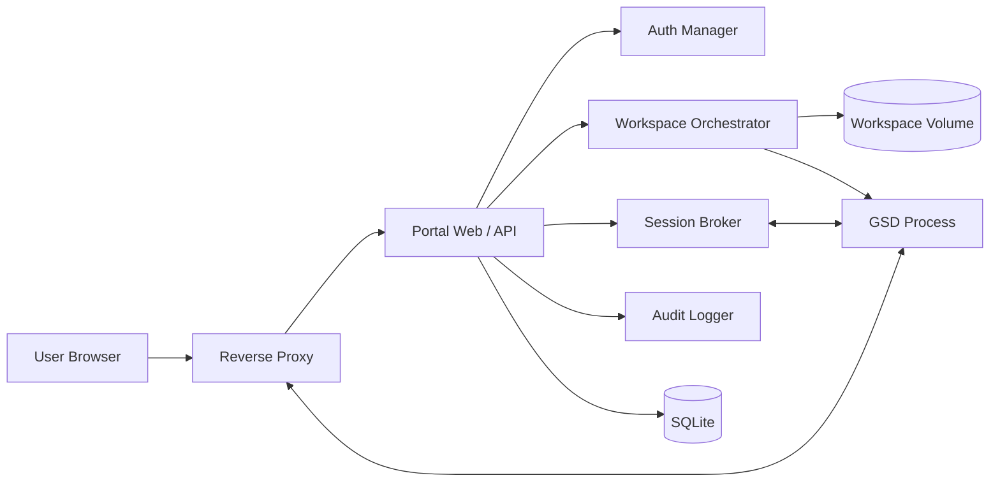
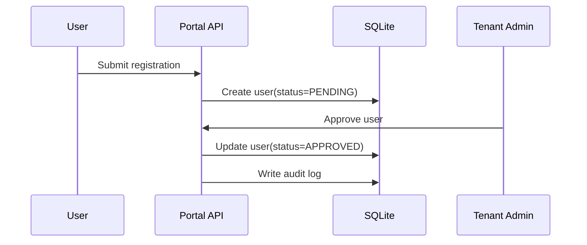
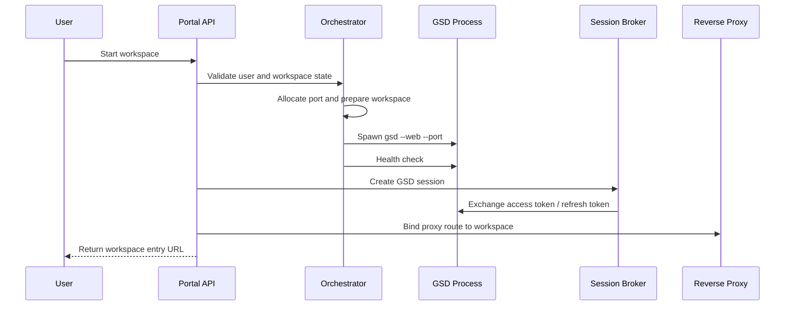
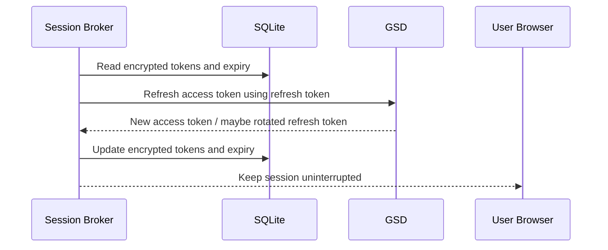

# GSD Portal System Design

## 0. 文档信息
- 版本：v1.0
- 状态：Draft for Engineering Review
- 输入文档：[PRD](../PRD.md)

## 1. 设计目标
本设计文档用于回答 4 个问题：
1. Portal、GSD、反向代理和数据库之间如何协作。
2. 用户如何从登录走到进入工作空间。
3. GSD access token / refresh token 如何被托管与续期。
4. 平台如何在单机、自托管、Docker Compose 部署前提下，保持安全、可审计和可运维。
5. Portal 前端如何以 HeroUI 为基础组件体系实现 `ui/design.png` 的界面风格。

## 2. 运行时架构

### 2.1 逻辑组件
| 组件 | 职责 |
| --- | --- |
| Portal Web | 提供登录、管理后台、工作空间入口与错误提示 |
| Portal API / BFF | 提供认证、审批、工作空间控制、审计查询等后端接口 |
| Auth Manager | 管理 Portal Session、登录态校验、权限判断 |
| Workspace Orchestrator | 负责端口分配、目录准备、GSD 进程启动、停止、重启和空闲回收 |
| Session Broker | 与 GSD 交互，托管 access token / refresh token，执行会话续期 |
| Reverse Proxy | 提供统一入口，转发 Portal 流量与用户工作空间流量，支持 WebSocket |
| Audit Logger | 记录审批、登录、工作空间启停、续期失败、管理员操作等事件 |
| SQLite Store | 保存租户、用户、工作空间、会话、审计日志等业务数据 |
| Workspace Runtime | 每个用户独占的 GSD 进程和对应工作目录 |

### 2.2 架构图


### 2.3 部署边界
1. MVP 默认单机部署。
2. Portal API、Auth Manager、Workspace Orchestrator、Session Broker、Audit Logger 运行在同一应用进程内，降低初期复杂度。
3. SQLite 作为嵌入式数据库随 Portal 一起运行，但数据库文件必须挂载到独立持久化卷。
4. Reverse Proxy 独立为单独容器，承担 HTTPS、WebSocket、统一路由和上游健康探测。

## 3. 核心模块设计

### 3.1 Portal Web
1. 提供登录页、注册页、审批结果页、工作空间控制页、管理员后台。
2. 仅渲染与当前用户权限匹配的操作。
3. 工作空间页必须展示当前工作空间状态，例如 `STARTING`、`RUNNING`、`ERROR`。
4. 当 GSD 会话续期失败时，前端需要展示明确的“会话失效，需要重新连接”提示。
5. 前端组件层统一使用 HeroUI（`heroui-inc/heroui`），不再引入第二套基础 UI 组件库。
6. 关键页面布局、卡片分组、状态标签和主按钮层级以 `ui/design.png` 为主要设计参考。

### 3.1.1 前端实现约束
1. 使用 HeroUI Provider 统一注入主题、暗亮模式策略和交互组件能力。
2. 样式层以 HeroUI + Tailwind CSS 为基础，不允许页面直接拼装风格冲突的第三方组件。
3. 通用组件应优先沉淀为 Portal 内部封装，例如 `AppShell`、`WorkspaceStatusCard`、`ApprovalTable`、`AuditLogTable`。
4. 如果设计稿与 HeroUI 默认样式不一致，应优先通过主题、slot class 和封装组件调整，而不是临时覆盖大量散落样式。

### 3.2 Auth Manager
1. 负责用户名密码登录、Portal Session 建立、登出与权限校验。
2. 使用 HttpOnly Cookie 持有 Portal Session。
3. Root Admin 与 Tenant Admin 的权限判断必须在服务端完成，前端不可作为授权依据。
4. 用户状态不是 `APPROVED` 时，Auth Manager 不得允许进入工作空间页面。

### 3.3 Workspace Orchestrator
1. 为用户分配或恢复唯一工作空间。
2. 准备工作目录、执行 `nosclaw/dev-env/setup.sh`、启动 `gsd --web --port <port>`。
3. 为每个用户只维护一个活动 GSD 进程。
4. 负责健康检查、错误恢复、强制停止、空闲回收和宿主机重启后的状态修正。
5. 将启动和停止结果写入 `audit_logs` 与 `workspace_instances`。

### 3.4 Session Broker
1. 在用户进入 GSD 前，与 GSD 建立下游会话。
2. 保存 GSD access token 与 refresh token 的密文，不允许下发 refresh token 到浏览器。
3. 在 access token 即将过期时主动续期，默认建议在过期前 120 秒触发刷新。
4. 同一 `workspace_session` 在任意时刻只允许一个 refresh 流程，避免并发刷新导致 refresh token 失效。
5. 若 refresh 连续失败，应写审计日志并通知前端重连。

### 3.5 Reverse Proxy
1. 统一暴露 `Portal UI` 与 `/workspace/:workspaceId` 入口。
2. 根据当前登录用户与绑定的工作空间，把请求代理到对应 GSD 端口。
3. 必须支持 HTTP 长连接与 WebSocket。
4. 不得把 GSD token 暴露在可复用 URL 中。

### 3.6 Audit Logger
1. 记录安全相关事件、管理员操作和工作空间关键动作。
2. 日志最少包含：`actor`、`tenant`、`action`、`resource`、`result`、`timestamp`、`metadata`。
3. Token 明文、密码、refresh token 不得进入审计日志。

## 4. 关键时序

### 4.1 用户注册与审批


### 4.2 启动工作空间并进入 GSD


### 4.3 GSD 会话续期


### 4.4 停用用户时的强制失效
1. Tenant Admin 执行 `SUSPEND`。
2. Portal API 更新用户状态为 `SUSPENDED`。
3. Session Broker 撤销对应 `workspace_session`。
4. Workspace Orchestrator 停止 GSD 进程。
5. Reverse Proxy 解除路由。
6. 前端收到“账号已停用”或“会话失效”的明确提示。

## 5. 会话设计

### 5.1 Portal Session
| 项目 | 设计 |
| --- | --- |
| 存储位置 | HttpOnly Cookie |
| 生命周期 | 由 Auth.js 管理，可配置过期时间 |
| 撤销条件 | 登出、用户停用、租户停用、管理员强制失效 |

### 5.2 GSD Session
| 项目 | 设计 |
| --- | --- |
| access token | 仅服务端持有，短时有效 |
| refresh token | 仅服务端密文存储，用于续期 |
| 存储位置 | `workspace_sessions` 表，字段使用应用层加密 |
| 续期时机 | 距离 access token 过期 120 秒以内 |
| 续期失败策略 | 1s / 3s / 5s 重试 3 次，失败后标记 `FAILED` 并提示重连 |
| 失效条件 | 用户登出、停用、工作空间停止、租户停用、refresh token 失效 |

### 5.3 续期设计原则
1. 浏览器侧只感知 Portal Session，不直接处理 GSD refresh token。
2. Session Broker 必须支持 refresh token 轮转。
3. 若 GSD 返回 token 已吊销或 refresh token 无效，Portal 需要区分“工作空间还在，但会话失效”和“工作空间本身已停止”。
4. 若工作空间处于 `RUNNING` 但会话失效，允许用户点击“重新连接”而不是重新创建工作空间。

## 6. API 面设计

### 6.1 Portal 公共接口
| 方法 | 路径 | 用途 |
| --- | --- | --- |
| `POST` | `/api/auth/register` | 用户注册 |
| `POST` | `/api/auth/login` | 用户登录 |
| `POST` | `/api/auth/logout` | 用户登出 |
| `GET` | `/api/health/live` | 存活检查 |
| `GET` | `/api/health/ready` | 就绪检查 |

### 6.2 管理员接口
| 方法 | 路径 | 用途 |
| --- | --- | --- |
| `POST` | `/api/bootstrap/root-admin` | 初始化 Root Admin，仅初始化阶段可用 |
| `POST` | `/api/admin/tenants` | 创建租户 |
| `POST` | `/api/admin/users/:id/approve` | 审批用户 |
| `POST` | `/api/admin/users/:id/reject` | 拒绝用户 |
| `POST` | `/api/admin/users/:id/suspend` | 停用用户 |
| `GET` | `/api/admin/audit-logs` | 查询审计日志 |

### 6.3 工作空间接口
| 方法 | 路径 | 用途 |
| --- | --- | --- |
| `GET` | `/api/workspaces/current` | 获取当前用户工作空间状态 |
| `POST` | `/api/workspaces/start` | 启动或恢复工作空间 |
| `POST` | `/api/workspaces/stop` | 停止工作空间 |
| `POST` | `/api/workspaces/restart` | 重启工作空间 |
| `POST` | `/api/workspaces/reconnect` | 仅重建 GSD 会话，不重建工作空间 |

## 7. 安全与隔离设计
1. 用户只能看到并操作自己的工作空间。
2. Tenant Admin 只能管理租户内用户，不得跨租户操作。
3. Root Admin 仅用于平台初始化和平台级运维，不作为日常开发用户。
4. GSD refresh token 必须加密存储，密钥通过环境变量注入。
5. 工作目录挂载必须限制在配置的根目录下，禁止路径穿越。
6. 反向代理必须对工作空间入口做服务端鉴权，而不是仅依赖前端路由隐藏。

## 8. 可观测性
1. `Portal API`、`Workspace Orchestrator`、`Session Broker` 使用统一 request id / workspace id / user id 打日志。
2. 关键指标：
   - 工作空间启动成功率
   - 会话续期成功率
   - 平均冷启动时长
   - 活跃工作空间数
   - 续期失败次数
3. 至少提供 `health`, `ready`, `version` 三类基础观测接口。

## 9. 建议代码结构
```text
src/
  app/
    (public)/
    (admin)/
    api/
  components/
    app-shell/
    workspace/
    admin/
    shared/
  modules/
    auth/
    tenants/
    users/
    workspaces/
    sessions/
    audit/
  lib/
    db/
    crypto/
    env/
    logger/
    proxy/
    runtime/
  providers/
    hero-ui-provider.tsx
```

## 10. 待确认技术决策
1. GSD 的 token 交换接口、refresh token 轮转规则和错误码是否稳定。
2. Workspace Orchestrator 运行在 Portal 进程内是否足够，还是需要独立 worker 进程。
3. Reverse Proxy 选用 Caddy 还是 Nginx。
4. `nosclaw/dev-env/setup.sh` 是否需要首次启动和后续启动区分执行模式。
